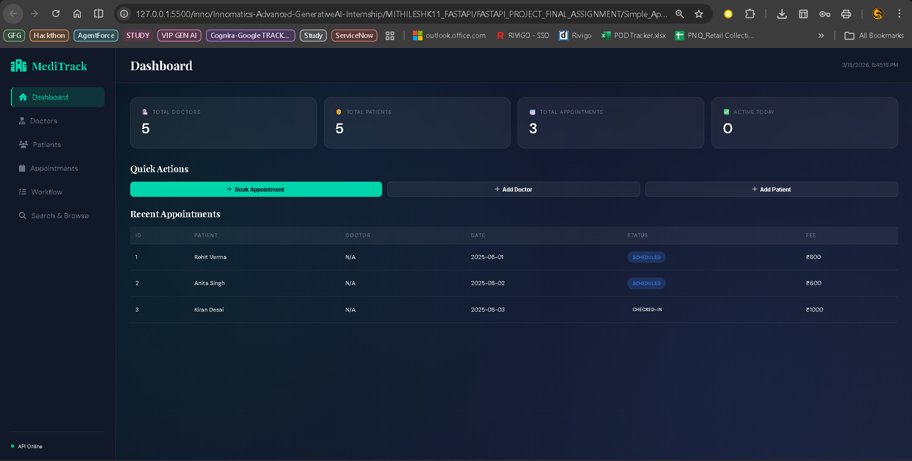

# Medical Appointment System - FastAPI + Modern UI

## Project Overview
A complete, production-ready medical appointment booking system with a modern premium UI and robust FastAPI backend. Manages doctors, patients, and appointments with full CRUD operations, multi-step workflows, and advanced search/filtering capabilities. The system uses in-memory Python lists for data storage and Pydantic for comprehensive data validation.

### Architecture
- **Backend**: FastAPI with CORS support for cross-origin requests
- **Frontend**: Single-file HTML UI with glassmorphism design and real-time data sync
- **Data Storage**: In-memory Python lists with auto-incrementing IDs
- **Validation**: Pydantic models with field validators
- **Styling**: Premium clinical luxury aesthetic with dark theme and teal accents

## Features

### Backend Features
- **Doctor Management**: Create, read, update, delete doctors with specialization and ratings
- **Patient Management**: Register patients with validation of personal information
- **Appointment Booking**: Schedule, track, and manage medical appointments
- **Appointment Workflow**: Three-step workflow (Scheduled → Checked-In → Completed)
- **Advanced Search**: Search doctors by name or specialization
- **Advanced Filtering**: Browse doctors with multiple filter criteria and pagination
- **Sorting**: Sort appointments by date, fee, or status
- **In-Memory Storage**: No database required, uses Python lists with auto-incrementing IDs
- **Comprehensive Validation**: Pydantic models with field validators
- **CORS Enabled**: Full cross-origin support for frontend integration

### Frontend Features
- **Modern Premium UI**: Clinical luxury design with glassmorphism effects
- **Responsive Layout**: Fixed sidebar navigation with adaptive content area
- **Dashboard**: Real-time stats with animated counters for system overview
- **Doctor Management Panel**: Grid view with cards, add/edit/delete functionality
- **Patient Registry**: Table view with sortable columns and blood group badges
- **Appointment Management**: Multi-tab interface for booking, viewing, and filtering
- **Visual Workflow Tracker**: Interactive diagram showing appointment journey
- **Advanced Search & Browse**: Real-time search with advanced filtering + pagination
- **Sorted Appointments**: Dynamic sorting by date, fee, or status
- **Toast Notifications**: Success/error messages with auto-dismiss (3 seconds)
- **Loading States**: Skeleton loading screens while fetching data
- **Confirm Modals**: Safe delete operations with confirmation dialogs
- **API Status Monitor**: Live indicator showing backend connection status
- **Dark Theme**: Eye-friendly clinical dark palette with teal & blue accents
- **Mobile Responsive**: Tablet and mobile friendly with collapsible sidebar

## Tech Stack

### Backend
- **Framework**: FastAPI
- **Server**: Uvicorn
- **Validation**: Pydantic
- **Language**: Python 3.7+
- **Middleware**: CORS (Cross-Origin Resource Sharing)

### Frontend
- **HTML5**: Semantic markup
- **CSS3**: Glassmorphism, animations, responsive design
- **JavaScript (Vanilla)**: No frameworks or dependencies
- **Fonts**: Google Fonts (Playfair Display, DM Sans)
- **Icons**: Font Awesome 6.5
- **Architecture**: Single-file application (index.html)

## How to Run

### Backend Setup
1. Install dependencies:
```bash
pip install -r requirements.txt
```

2. Run the FastAPI application:
```bash
uvicorn main:app --reload
```

3. Backend will start on: **http://127.0.0.1:8000**
   - Swagger UI (API Explorer): http://127.0.0.1:8000/docs
   - ReDoc (Alternative API Docs): http://127.0.0.1:8000/redoc

### Frontend Setup
1. Navigate to the `Simple_Application` folder:
```
d:\DELL\Documents\Intel\inno\Innomatics-Advanced-GenerativeAI-Internship\MITHILESHK11_FASTAPI\FASTAPI_PROJECT_FINAL_ASSIGNMENT\Simple_Application\
```

2. Open `index.html` in a web browser (Chrome/Firefox/Edge recommended)

3. The UI will automatically connect to the backend on **http://127.0.0.1:8000**

### Full Workflow
```
1. Start Backend:   uvicorn main:app --reload    (Terminal 1)
2. Wait for:        "Application startup complete"
3. Open UI:         Open index.html in browser    (Terminal 2 or directly)
4. Verify Status:   Green dot in sidebar = "API Online"
5. Start Using:     Dashboard will load with live data
```

### Requirements
- Python 3.7+
- Modern web browser (Chrome, Firefox, Safari, Edge)
- CORS enabled on backend (automatically configured)

## API Endpoints Table

### Home
| Method | Endpoint | Description |
|--------|----------|-------------|
| GET | `/` | Welcome message with system overview |

### Doctors - GET Operations
| Method | Endpoint | Description |
|--------|----------|-------------|
| GET | `/doctors/summary` | Summary statistics of all doctors |
| GET | `/doctors/search` | Search doctors by keyword (name/specialization) |
| GET | `/doctors/browse` | Advanced browse with filters and pagination |
| GET | `/doctors` | List all doctors |
| GET | `/doctors/{doctor_id}` | Get specific doctor by ID |

### Doctors - Write Operations
| Method | Endpoint | Description |
|--------|----------|-------------|
| POST | `/doctors` | Create new doctor |
| PUT | `/doctors/{doctor_id}` | Update doctor details |
| DELETE | `/doctors/{doctor_id}` | Delete doctor |

### Patients
| Method | Endpoint | Description |
|--------|----------|-------------|
| GET | `/patients` | List all patients |
| POST | `/patients` | Create new patient |
| PUT | `/patients/{patient_id}` | Update patient details |

### Appointments - Sorting & Booking
| Method | Endpoint | Description |
|--------|----------|-------------|
| GET | `/appointments/sorted` | Get sorted appointments |
| POST | `/appointments/book` | Book new appointment |
| GET | `/appointments` | Get appointments with optional filters |
| GET | `/appointments/{appointment_id}` | Get appointment with doctor/patient names |

### Appointments - Workflow
| Method | Endpoint | Description |
|--------|----------|-------------|
| DELETE | `/appointments/{appointment_id}` | Cancel appointment |
| POST | `/appointments/{appointment_id}/checkin` | Check in patient |
| POST | `/appointments/{appointment_id}/complete` | Complete appointment with prescription |
| GET | `/appointments/{appointment_id}/history` | View full appointment lifecycle |

## Workflow Diagram

```
Appointment Lifecycle:

Scheduled ──→ Checked-In ──→ Completed
     ↓                            ↓
     └──────→ Cancelled ←─────────┘

Steps:
1. Scheduled  : Initial booking state
2. Checked-In : Patient arrives and checks in
3. Completed  : Appointment finished with prescription
4. Cancelled  : Appointment cancelled at any stage
```

## UI Navigation & Sections



### 🏠 Dashboard
- **Overview Stats**: Real-time counters for Doctors, Patients, Appointments, Active Today
- **Quick Actions**: Fast links to Book Appointment, Add Doctor, Add Patient
- **Recent Appointments**: Table showing latest 5 appointments with status badges

### 👨‍⚕️ Doctors Section
- **All Doctors Tab**: Card grid view with doctor avatars, rating (⭐), fee (💰), experience (🕐)
  - Filter by Specialization
  - View Availability status (Green: Available | Red: Unavailable)
  - Edit/Delete buttons per doctor
- **Add Doctor Tab**: Form to create new doctor with validation
  - Name, Specialization, Experience (1-50 years), Consultation Fee
  - Rating slider (1.0-5.0) with live preview
  - Available toggle switch
- **Summary Tab**: Statistics overview
  - Total Doctors, Available Count, Unavailable Count
  - Average Rating, Average Consultation Fee

### 🧑‍🤝‍🧑 Patients Section
- **All Patients Tab**: Sortable data table with columns
  - ID, Name, Age, Gender (♂/♀), Contact, Blood Group (colored badges)
  - Edit button per patient
- **Add Patient Tab**: Registration form with validation
  - Name, Age (1-120), Gender dropdown, Contact (10 digits enforced)
  - Blood Group dropdown (A+, A-, B+, B-, AB+, AB-, O+, O-)

### 📅 Appointments Section
- **All Appointments Tab**: Comprehensive table showing
  - ID, Patient, Doctor, Date, Time, Reason, Status, Fee
  - Status badges (🔵 Scheduled, 🟡 Checked-In, 🟢 Completed, 🔴 Cancelled)
  - Context-aware action buttons (Check-In, Complete, History, Cancel)
- **Book New Tab**: Appointment booking form
  - Patient dropdown (auto-populated)
  - Doctor dropdown (shows fee, auto-updates consultation fee)
  - Date picker (min = today), Time picker
  - Reason text input
  - Auto-calculated total fee display
- **Filter Tab**: Advanced filtering
  - Filter by Status, Date, or both
  - Results shown in formatted table

### 🔄 Workflow Section
- **Visual Journey Tracker**: Interactive appointment workflow diagram
  - Highlights current status with animated glow
  - Shows: Scheduled → Checked-In → Completed
- **Appointment Input**: Load any appointment by ID
- **Status-Aware Actions**:
  - If Scheduled: [✅ Check In Patient] button
  - If Checked-In: Prescription textarea + [🏁 Complete & Save] button
  - If Completed: Show prescription in styled box + "Journey Complete" badge
  - If Cancelled: "Appointment Cancelled" message
- **History View**: Modal popup with full appointment lifecycle

### 🔍 Search & Browse Section
- **Search Doctors Tab**: Real-time keyword search
  - Live search (300ms debounce) by name or specialization
  - Results displayed as doctor cards
- **Browse Doctors Tab**: Advanced filtering + pagination
  - Multi-field filters: Search, Specialization, Min/Max Fee, Min Rating
  - Available Only toggle, Sort By (fee/rating/experience)
  - Order by (Ascending/Descending), Page Size (3/5/10)
  - Pagination controls: [← Prev] Page X of Y [Next →]
- **Sorted Appointments Tab**: Sort & view appointments
  - Sort By options: Date, Fee, Status
  - Order: Ascending/Descending
  - Results in formatted table

## Global UI Features

### 🎨 Design Elements
- **Color Scheme**: Deep navy (#0A0F1E) + Teal (#00D4AA) accents + Blue (#3B82F6) secondary
- **Glassmorphism**: Blur effects on cards and panels for premium feel
- **Typography**: Playfair Display (headings - elegant), DM Sans (body - clean)
- **Animations**: Smooth fade-ins, hover effects, status pulse animations
- **Gradients**: Background mesh gradients for visual depth

### 🔔 Notifications System
- **Toast Messages**: Top-right notifications
  - ✅ Green for success (auto-dismiss 3s)
  - ❌ Red for errors (auto-dismiss 3s)
  - Shows detailed error messages from API

### 📍 Sidebar Navigation
- **Fixed Left Sidebar** (260px wide)
- **Logo**: 🏥 MediTrack with teal color
- **Navigation Links**: Dashboard, Doctors, Patients, Appointments, Workflow, Search & Browse
- **Active Indicator**: Teal highlight + left border on current section
- **API Status**: Green/Red dot indicator with "Online/Offline" text
- **Auto Refresh**: API status checks every 30 seconds

### 🔐 Modals & Dialogs
- **Confirm Modals**: Before delete operations
  - "Are you sure?" message with [Cancel] [Confirm Delete]
- **Info Modals**: View full appointment history
  - Appointment details, patient name, doctor name, prescription (if any)

### 📱 Responsive Behavior
- **Desktop** (1200px+): Full sidebar + multi-column layouts
- **Tablet** (768px-1199px): Adjusted spacing, 2-column grids
- **Mobile** (<768px): Hamburger sidebar, single-column layouts, horizontal scrollable tables

---

## Data Models

### Doctor
- doctor_id (int, auto-generated)
- name (str, min 3 chars)
- specialization (str)
- experience_years (int, 1-50)
- consultation_fee (float, > 0)
- available (bool, default=True)
- rating (float, 1.0-5.0)

### Patient
- patient_id (int, auto-generated)
- name (str, min 3 chars)
- age (int, 1-120)
- gender (str)
- contact (str, exactly 10 digits)
- blood_group (str)

### Appointment
- appointment_id (int, auto-generated)
- patient_id (int)
- doctor_id (int)
- appointment_date (str, YYYY-MM-DD)
- appointment_time (str, HH:MM)
- reason (str)
- status (str, default="Scheduled")
- prescription (str, optional)
- total_fee (float, auto-calculated)

## HTTP Status Codes
- 200 OK - Successful GET, PUT, DELETE
- 201 Created - Successful POST
- 400 Bad Request - Invalid data or business logic error
- 404 Not Found - Resource not found
- 422 Validation Error - Pydantic validation failure

## Project File Structure

```
FASTAPI_PROJECT_FINAL_ASSIGNMENT/
├── main.py                          # FastAPI backend (all endpoints)
├── requirements.txt                 # Python dependencies
├── README.md                        # This file
└── Simple_Application/
    └── index.html                   # Frontend UI (single file)
```

## Key Files

### Backend: `main.py`
- 20 fully functional API endpoints
- Pydantic models with validation
- CORS middleware enabled
- In-memory data storage with seed data
- All helper functions implemented

### Frontend: `Simple_Application/index.html`
- Single-file HTML application (1000+ lines)
- Embedded CSS (glassmorphism design)
- Embedded JavaScript (vanilla, no dependencies)
- All 20 endpoints fully integrated
- Responsive mobile-friendly layout

## API Integration

The UI automatically connects to the FastAPI backend at **http://127.0.0.1:8000**

### Request Flow
1. User interacts with UI (click, form submission)
2. JavaScript makes fetch request to API endpoint
3. Backend processes request, validates with Pydantic
4. Backend returns JSON response
5. UI updates display with toast notification + data

### CORS Configuration
Backend includes CORS middleware allowing:
- Any origin (`*`)
- All HTTP methods (GET, POST, PUT, DELETE, etc.)
- All headers
- Credentials enabled

This ensures the UI can make requests from `file://` protocol (local file access)

## Testing the Application

### Manual Testing Workflow
1. **Dashboard**: Verify 5 doctors, 5 patients loaded
2. **Doctors**: 
   - View all preloaded doctors in card grid
   - Add new doctor via form
   - Search for doctor by name
   - Browse with filters
3. **Patients**:
   - View all preloaded patients in table
   - Add new patient with 10-digit contact validation
4. **Appointments**:
   - View 3 pre-booked appointments
   - Book new appointment (auto-calculates fee)
   - Filter by status/date
   - Try workflow: Check-In → Complete with prescription
5. **Search & Browse**:
   - Real-time doctor search
   - Advanced browse with pagination
   - Sort appointments

### Expected Seed Data
**Doctors** (5 total):
- Dr. Anil Sharma (Cardiologist, ₹800)
- Dr. Priya Mehta (Dermatologist, ₹600)
- Dr. Ramesh Gupta (Neurologist, ₹1000)
- Dr. Sneha Patil (Orthopedic, ₹750)
- Dr. Arjun Nair (General Physician, ₹400)

**Patients** (5 total):
- Rohit Verma, Anita Singh, Kiran Desai, Meena Joshi, Raj Patel

**Appointments** (3 total):
- All in August 2025 with different statuses

## Troubleshooting

### Issue: "API Offline" in UI
**Solution**: Make sure FastAPI backend is running
```bash
uvicorn main:app --reload
```

### Issue: CORS Errors in browser console
**Solution**: Already fixed in main.py with CORS middleware. If still occurring:
1. Restart backend
2. Clear browser cache
3. Check backend is on http://127.0.0.1:8000

### Issue: No data showing in UI
**Solution**: 
1. Check browser console (F12 → Console tab) for errors
2. Verify API is online (green dot in sidebar)
3. Refresh the page (Ctrl+R or Cmd+R)
4. Try different browser

### Issue: Form validation errors
**Solution**: Check the validation rules in main.py:
- Contact must be exactly 10 digits
- Name must be at least 3 characters
- Age must be 1-120
- Doctor experience must be 1-50 years
- Fee must be greater than 0

## Performance Notes
- All data stored in memory (resets on backend restart)
- No database queries (instant responses)
- Real-time search with 300ms debounce
- Lazy loading of appointment history
- Efficient pagination on browse page

## Future Enhancements (Not Implemented)
- PostgreSQL/MongoDB database integration
- User authentication & authorization
- Email notifications for appointments
- SMS reminders
- Multiple clinic locations
- Doctor availability calendar
- Appointment ratings & reviews
- Payment integration
- Appointment rescheduling
- Export to PDF/Excel
- Admin dashboard with analytics
